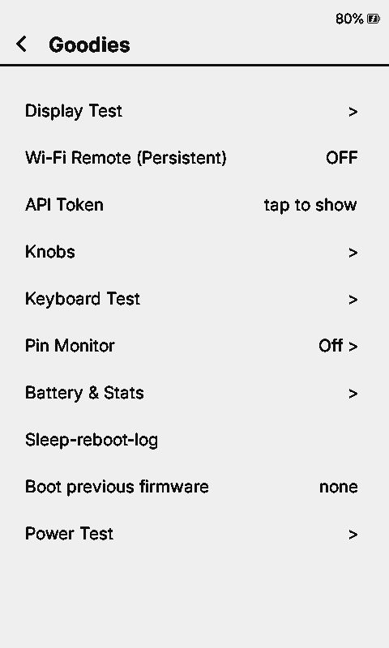

# x4prosim

An emulator for the **Xteink X4 Pro** e-reader (ESP32-S3R8, 16 MB flash, 8 MB
octal PSRAM). It runs **unmodified X4 Pro firmware**, whether that's the stock
firmware, CrossInk, CrossDink, or a bare ESP-IDF/Arduino app. The screen, SD
card, keys, touch, clock, battery gauge and Wi-Fi all behave like the board, so
you can develop firmware without the device.



Built on Espressif's QEMU fork (`esp-develop`). The rule is that no firmware is
ever changed to make it boot here: the hardware is modeled from datasheets and
from the real board instead.

## Quick start

```sh
# deps (Debian/Ubuntu)
sudo apt install ninja-build libglib2.0-dev libpixman-1-dev libgcrypt20-dev \
  libslirp-dev libsdl2-dev dosfstools python3-pip && pip install esptool
mkdir build && cd build
../configure --target-list=xtensa-softmmu --enable-gcrypt --enable-slirp --enable-sdl \
  --disable-strip --disable-user --disable-capstone --disable-vnc --disable-gtk --disable-docs
ninja qemu-system-xtensa && cd ..

x4prosim/mkflash.sh <pio or idf build dir> flash.bin   # bootloader + partitions + app -> 16 MB image
x4prosim/run.sh flash.bin sd.img                       # SDL window, firmware log on stdout
```

A flash dump of a real device works too, as long as it doesn't use flash
encryption: `esptool.py --chip esp32s3 read_flash 0 0x1000000 flash.bin`.
`sd.img` is created on first run (1 GB FAT32); `x4prosim/mksd.py sd.img 1024 books/`
copies a folder of books in.

**Controls:** arrow keys are Up/Down and `P` is Power. Click in the window to
touch. Monitor: `socat - unix:/tmp/x4prosim-mon.sock`.

**Headless / scripted:**
```sh
x4prosim/drive.py flash.bin sd.img log.txt wait:30 press:down shot:home.png \
  "hmp:qom-set /machine/gt911 tap 240,529" wait:5 shot:settings.png
```

## What's emulated

| Part | Model | Status |
| --- | --- | --- |
| CPU, flash, PSRAM | ESP32-S3 dual core, 16 MB flash, 8 MB octal PSRAM | done |
| Display | UC8179 800x480 e-ink: identity/OTP probe, register LUTs, animated refreshes, physical ghosting fitted to device photos | done |
| SD card | SDMMC, FAT32 image | done |
| Keys | Up, Down, Power (GPIO, wake from light sleep) | done |
| Touch | GT911 on I2C | done |
| Clock | BM8563 RTC on I2C | done |
| Battery | CW2017 fuel gauge on I2C | done |
| Wi-Fi | emulated MAC + a fake open AP (`PICSimLabWifi`), bridged to the host network | done |
| Light sleep | RTC timer and GPIO wake | done |
| Frontlight, charger STAT, deep sleep, USB OTG | | not yet |

**Wi-Fi.** Join `PICSimLabWifi` on the device. By default it uses QEMU's NAT:
the device gets 10.0.2.15, and `curl localhost:8080` reaches its port 80. To
put it on your LAN, so it gets an address from your router, run with
`X4BR=br0` on a host bridge (setup in [X4PROSIM.md](X4PROSIM.md)).

**Panel.** Every ghosting and timing parameter can be tuned or turned off with
`-global uc8179.<name>=N`. For quick scripted runs, `-global uc8179.animate=false`
skips the animation. See [x4prosim/ghosting/README.md](x4prosim/ghosting/README.md).

## Docs

- [X4PROSIM.md](X4PROSIM.md): the full guide. It covers building firmware for
  the sim, debugging a hang with gdb, every model and its options, the X4 Pro
  pin map, what's still missing, and how to contribute a peripheral.
- [x4prosim/testdata/](x4prosim/testdata/README.md): real device logs, the
  panel OTP and battery history, for checking a simulated run against the
  device.
- [x4prosim/ghosting/](x4prosim/ghosting/README.md): how the e-ink model works,
  its calibration against photos, and step files and tools for repeating it.

## Contributing

Branch off `x4prosim`, keep one peripheral per PR, and use commit messages of
the form `x4prosim: <what>`. Read the workflow section of
[X4PROSIM.md](X4PROSIM.md) first.

## License and credits

- QEMU is GPL-2.0; see [COPYING](COPYING) and [LICENSE](LICENSE). The original
  QEMU README is [README.rst](README.rst).
- The ESP32 SoC models come from Espressif's QEMU fork.
- The Wi-Fi MAC and access-point emulation is adapted from lcgamboa's ESP32
  QEMU work. The AP code is by Clemens Kolbitsch, modified for the ESP32 by Martin
  Johnson (MIT); see the file headers.
